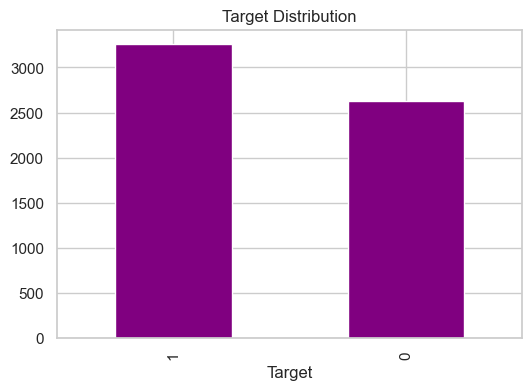
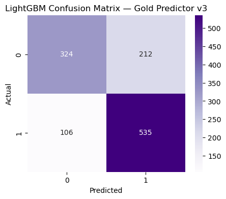
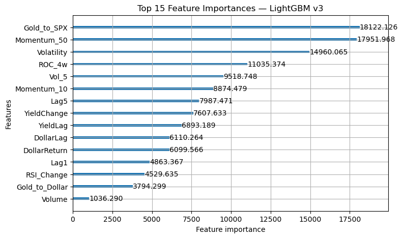
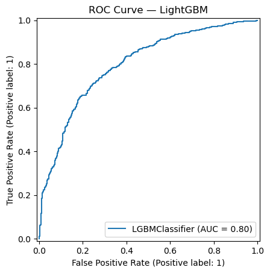

# Gold Direction Prediction with Machine Learning

A machine learning pipeline for forecasting 10-day gold price direction using technical indicators and macroeconomic features.

## Project Overview

This project builds a supervised machine learning model that predicts whether gold will go up or down the next 10 days.  
Gold price movements are influenced by volatility, interest rates, equities, and macroeconomic cycles.  
The goal of this project is to:

- Construct a reproducible ML pipeline  
- Engineer predictive financial features  
- Compare a baseline model to an optimized LightGBM model  
- Evaluate performance using standard metrics  
- Visualize insights and model behavior  

This project was completed as the final project for Applied Machine Learning.

---

## Repository Structure

```text
.
├── notebooks/            # EDA, LightGBM model
│   ├── 01_eda.ipynb
│   └── 02_final_model.ipynb
│
├── src/                  
│   ├── dataset/
│   │   └── data.py       # DataLoader class
│   ├── model/
│   │   └── model.py      # LightGBM model wrapper
│   └── trainer/
│       └── trainer.py    # Full training pipeline + evaluation
│
├── results/              # Saved images and model outputs
│   ├── target_distribution.png
│   ├── lightgbm_confusion_matrix.png
│   ├── lightgbm_feature_importance.png
│   └── lightgbm_roc_curve.png
│
├── requirements.txt      # Python dependencies
└── README.md

```

## Dataset Description

The dataset is not included in this repository, per project guidelines.  
It can instead be recreated using `src/dataset/data.py`, which downloads:

- Gold futures data (GC=F)  
- Dollar Index (DX=F)  
- 10-Year Treasury Yield (^TNX)  
- Crude Oil (CL=F)  
- S&P 500 Index (^GSPC)  
- VIX Volatility Index (^VIX)  

Technical indicators are also engineered, including:

- Returns (simple + log)  
- Rolling volatility  
- MA20 and MA200  
- Lagged values  

### Target Variable

1 → 10-day gold closes higher  
0 → 10-day gold closes lower  

This is a binary classification task.

---

# 1. Exploratory Data Analysis (EDA)

**Location:** `notebooks/01_eda.ipynb`

Includes:

- Target distribution analysis  
- Summary statistics  
- Correlation heatmap  
- Macro–gold relationships  
- Feature behavior over time  

### Example: Target Distribution



# 2. Final Model — LightGBM (Gradient Boosting)

**Model Code:** `src/model/model.py`  
**Training Code:** `src/trainer/trainer.py`  
**Notebook:** `notebooks/02_final_model.ipynb`

### Why LightGBM?

- Captures nonlinear interactions  
- Handles correlated features well  
- Efficient training  
- Built-in class imbalance handling (`scale_pos_weight`)  
- Early stopping for generalization  

### Training Enhancements

- Feature clipping to reduce outlier influence  
- Early stopping (50 rounds)  
- Threshold optimization using Precision-Recall curve  
- Evaluation on unseen test split  

### Final Model Performance

Accuracy: 0.730  
F1 Score: 0.771  
ROC AUC: 0.798  
PR AUC: 0.798  

---

## Model Visualizations

### Confusion Matrix (LightGBM)



### Feature Importance



### ROC Curve



---

# How to Run the Project

## Clone the Repository

git clone <your-repo-link>
cd your-project-name

## Install Required Packages

pip install -r requirements.txt


# Key Insights

- Gold direction is influenced by both technical and macroeconomic indicators.  
- LightGBM provides a substantial improvement over Logistic Regression.  
- Volatility, returns, and macroeconomic variables are among the most important predictors.  
- Threshold tuning improves real-world performance beyond default probability cutoffs.  

---

# Future Work
  
- Use walk-forward time-series cross-validation  
- Include more macroeconomic indicators (CPI, Fed Funds Rate, GDP)  
- Experiment with CatBoost, or neural networks  
- Extend the problem to single-day forecasting 
- Add news insights as a feature 

---

# Acknowledgments

This project was completed for the Applied Machine Learning course at Villanova University.
